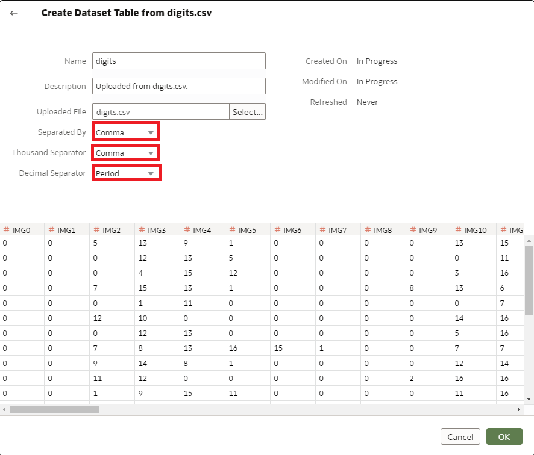
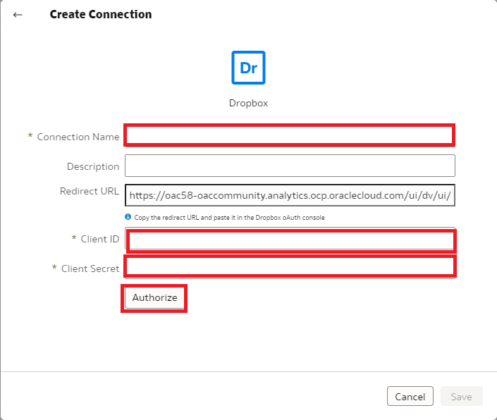
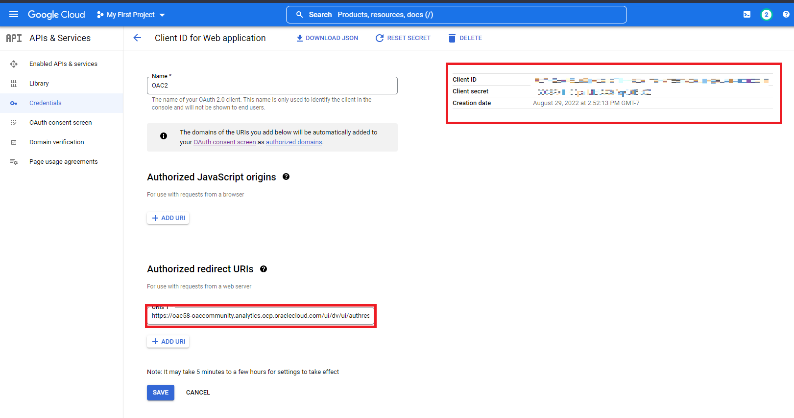

# How do I join local tables in Oracle Analytics Cloud (OAC)?
Duration: 3 minutes

Joining tables in Oracle Analytics Cloud (OAC) has received some new updates as of May 2022. You can add files to datasets with multiple tables. When you create a dataset, you can add tables from relational sources, local subject areas, and files. Each new entity created in datasets can be based on any of these data sources. This enables you to add multiple files to one dataset where each file becomes a table and to define joins between tables within a dataset. In addition, you can add files from Dropbox or Google Drive to a dataset with multiple tables. 

## Add files to datasets with multiple tables

>**Note:** You must have the **DV Content Author** application role to execute the following steps.

>**Note:** This procedure is only available of OAC version May 2022 or newer. OAS updates happen annually, while OAC updates are more frequent. Therefore, in order to implement this automation, you need to ensure that the OAS version postdates May 2022.

>**Note:** Before you create the dataset, confirm that the connection you need exists. Confirm that the file that you want to upload meets these requirements:
    - The file is either an Excel spreadsheet in .XLSX or .XLS format, a CSV file, or a TXT file.
    - The spreadsheet contains no pivoted data.
    - The spreadsheet is structured properly for import and use as a dataset. 

### Create a Dataset from a File Uploaded from Your Computer
You can upload Excel spreadsheets (XLSX or XLS), CSV files, and TXT files from your computer to create a dataset.

1. On the Home page, click Create and then click Dataset.

    

2. In the Create Dataset dialog, either drag and drop a file to the dialog, or click **Drop data file here or click to browse** to browse your computer for a file to upload.

    

3. In the Create Dataset page's **Name** field, provide a name for the dataset table created from the file.

 

4. (Optional) If you’re uploading a CSV or TXT file, then in the Separated By, Thousand Separator, and Decimal Separator fields, confirm or change the default delimiters. To specify a custom delimiter, choose Custom in the Separated By field and enter the character you want to use as the delimiter. In the CSV or TXT file, a custom delimiter must be one character. The following example uses a pipe (|) as a delimiter: Year|Product|Revenue|Quantity|Target Revenue| Target Quantity.

    

5. Click OK to upload the file and create the dataset.
   
   

### Create a Dataset from a File Uploaded from Dropbox or Google Drive

Another way to populate the calculation page is by predefining clusters or outliers in your data and right-click-save in **My Calculations** folder. 

1. On the Home page, click **Create** and then click **Dataset.**

    

2. In the Create Dataset dialog, select a connection

    

3. After you provide connection information, browse for and select the file that you want to upload.

    

    The Client ID and Key will be found after creating an app for dropbox. You access the app console by clicking this link: 
    - [Dropbox apps](https://www.dropbox.com/developers/apps)
    - [Google Drive API](https://console.cloud.google.com/apis/library/drive.googleapis.com?project=buoyant-planet-241022)

    For Dropbox you will need to create an app to access credentials. You will also need to paste the **Redirect URL** from OAC's create connection window.

    

    For Google Drive you need to **Enable** the API and create credentials to access Key and secret.

    

    Paste the **Redirect URL** from OAC's connection window.

    

    In order to access the API, it needs to be published first.

    
   
  
4. Select **Authorize** and then **OK.** The menu will then populate with your storage data. You can select the dataset from the menu options.

    

## Learn More

* [What's new in the Oracle Analytics Cloud May 2022 update (Video)](https://www.youtube.com/watch?v=K3YaJlmfSpM)
* [OAC - Create Datasets from Files](https://docs.oracle.com/en/cloud/paas/analytics-cloud/acubi/create-dataset-files.html#GUID-04CF3C71-DE49-4D6C-971E-6EAFDBB92D82)
* [Dropbox API permissions](https://developers.dropbox.com/oauth-guide)

## Acknowledgements

* **Author** - Nicholas Cusato, Solution Engineer, Santa Monica Specialists Hub

* **Last Updated By/Date** - Nicholas Cusato, August 2022
